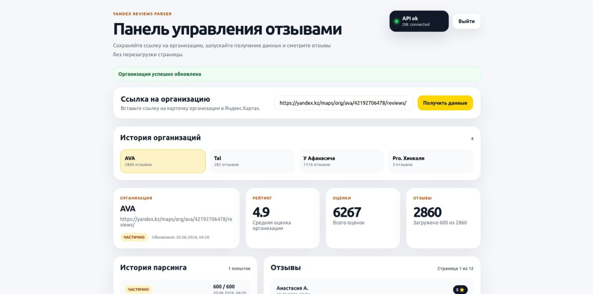

# Yandex Reviews Parser


## Описание проекта

**Yandex Reviews Parser** — веб-приложение для сбора, хранения и просмотра отзывов организаций из Яндекс.Карт.

Система позволяет:

- авторизоваться в приложении;
- сохранять ссылки на организации Яндекс.Карт;
- получать информацию об организации;
- собирать отзывы пользователей;
- хранить историю парсинга;
- просматривать ранее добавленные организации;
- работать с несколькими доменами Яндекса;
- просматривать отзывы с пагинацией.

Проект разработан как **инженерный прототип** сервиса агрегации отзывов с акцентом на **чистую архитектуру**, **расширяемость** и **тестируемость**.

---

## Возможности

### Авторизация

Поддерживаются:

- Login
- Logout
- Получение текущего пользователя

Используется **Laravel Sanctum**.

---

### Работа с организациями

Пользователь может:

- сохранить URL организации;
- повторно открыть ранее сохранённую организацию;
- просмотреть историю организаций;
- получить текущий статус парсинга;
- просмотреть количество найденных отзывов.

---

## Результаты

- До 600 отзывов на организацию
- Пагинация по 50 отзывов
- Поддержка нескольких доменов Яндекса
- История запусков парсинга
- 12 автоматических тестов
- Docker-развёртывание одной командой

---

### Парсинг отзывов

Парсер получает:

- название организации;
- рейтинг;
- количество оценок;
- количество отзывов;
- список отзывов.

Поддерживаются **региональные домены Яндекса**.

На текущий момент протестированы:

- `yandex.ru`
- `yandex.kz`
- `yandex.by`

Базовый URL API определяется **автоматически** на основании URL организации.

---

### История парсинга

Для каждого запуска сохраняется:

- время запуска;
- время завершения;
- статус выполнения;
- количество загруженных отзывов;
- диагностическая информация;
- ошибка при неудачном запуске.

---

### Пагинация отзывов

Отзывы выдаются постранично.

**Размер страницы: 50 отзывов**

Поддерживается переключение страниц без перезагрузки интерфейса.

---

## Скриншоты

### Dashboard

Главная страница приложения.



### Reviews

Просмотр отзывов организации.


---

## Технологический стек

### Backend

- **PHP 8.2**
- **Laravel 11**
- **PostgreSQL**
- Sanctum
- Eloquent ORM
- Form Request Validation
- API Resources
- Dependency Injection
- Service Layer
- DTO
- Custom Exceptions

### Frontend

- **Vue 3**
- Vue Router
- Vite
- Fetch API

### Инфраструктура

- **Docker**
- Docker Compose
- PostgreSQL 16

### Качество кода

- PHPUnit
- PHPStan
- Laravel Pint

---

## API Endpoints

### Auth

- `POST /api/login`
- `GET /api/me`
- `POST /api/logout`

### Organizations

- `GET /api/organization`
- `POST /api/organization`
- `GET /api/organizations`
- `GET /api/organizations/{organization}`

### Reviews

- `GET /api/organization/reviews`
- `GET /api/organizations/{organization}/reviews`

### Parse Attempts

- `GET /api/organization/parse-attempts`
- `GET /api/organizations/{organization}/parse-attempts`

### Health Check

- `GET /api/health`

---

## Архитектура

Проект построен по принципу **разделения ответственности**.

### Controllers

Отвечают только за:

- получение запроса;
- вызов сервисов;
- возврат ответа.

**Бизнес-логика в контроллерах отсутствует.**

---

### Services

**OrganizationService**

Отвечает за:

- создание организации;
- запуск парсинга;
- сохранение отзывов;
- обновление статусов;
- обработку ошибок.

**OrganizationReadService**

Отвечает за чтение данных и кеширование.

---

### Parser Layer

Используется абстракция:

`YandexMapsParserInterface`

Реализации:

- `FakeYandexMapsParser`
- `RealYandexMapsParser`

Благодаря интерфейсу парсер можно заменить **без изменения бизнес-логики**.

---

### DTO

Используются объекты передачи данных:

**ParsedOrganizationData**

Содержит:

- название;
- рейтинг;
- количество оценок;
- количество отзывов;
- список отзывов.

**ParsedReviewData**

Содержит:

- автора;
- текст;
- рейтинг;
- дату публикации;
- внешний идентификатор.

---

## Структура базы данных

### users

Хранение пользователей.

---

### organizations

| Поле | Назначение |
|---|---|
| `user_id` | владелец |
| `yandex_url` | ссылка |
| `name` | название |
| `rating` | рейтинг |
| `ratings_count` | количество оценок |
| `reviews_count` | количество отзывов |
| `parse_status` | статус |
| `parse_error` | ошибка |
| `last_parsed_at` | последний запуск |

---

### reviews

| Поле | Назначение |
|---|---|
| `organization_id` | организация |
| `external_id` | внешний идентификатор |
| `author_name` | автор |
| `reviewed_at` | дата |
| `text` | текст |
| `rating` | оценка |

---

### parse_attempts

История запусков парсера.

Содержит:

- статус;
- длительность;
- ошибки;
- количество собранных отзывов;
- метаданные.

---

## Статусы парсинга

Поддерживаются следующие состояния:

- `pending`
- `processing`
- `success`
- `partial`
- `failed`

---

## Обработка ошибок

Выделены отдельные типы исключений:

- `InvalidYandexMapsUrlException`
- `YandexMapsParserException`
- `YandexMapsUnavailableException`
- `YandexReviewsNotFoundException`
- `OrganizationParsingAlreadyRunningException`

Это позволяет возвращать корректные HTTP-ответы и упрощает диагностику.

---

## Производительность

Реализованы:

- индексы PostgreSQL;
- ограничение количества отзывов;
- пагинация;
- кеширование чтения данных;
- пакетное сохранение результатов;
- повторные попытки HTTP-запросов;
- таймауты внешних запросов.

---

## Безопасность

Используются:

- **Sanctum Authentication**;
- Form Requests;
- Validation Rules;
- Rate Limiting;
- защита от невалидных URL;
- ограничение доступа к чужим организациям.

---

## Тестирование

Проект покрыт **Unit** и **Feature** тестами.

### Unit Tests

**`OrganizationServiceTest`**

Проверяет:

- сохранение отзывов;
- обновление организации;
- замену старых отзывов;
- обработку частичного результата;
- обработку ошибок парсера.

### Feature Tests

**`AuthApiTest`**

Проверяет:

- вход с неверными данными;
- получение профиля авторизованным пользователем;
- запрет доступа гостю.

**`OrganizationApiTest`**

Проверяет:

- доступ только авторизованным пользователям;
- получение только собственных организаций;
- запрет доступа к чужим организациям;
- получение выбранной организации;
- пагинацию отзывов.

### Результат запуска тестов

```
Tests:       12 passed
Assertions:  39 passed
Duration:    ~1s
```

---

## Использованные практики

- Service Layer Pattern
- Dependency Injection
- DTO Pattern
- Repository-like Read Service
- Resource API Responses
- Custom Validation Rules
- Custom Exceptions
- Pagination
- Caching
- Rate Limiting
- Dockerized Environment
- Unit Testing
- Feature Testing

---

## Структура проекта

```
backend/
├── app/
│   ├── Http/
│   │   ├── Controllers/
│   │   ├── Requests/
│   │   └── Resources/
│   ├── Models/
│   ├── Services/
│   │   ├── Organization/
│   │   └── YandexMaps/
│   ├── Rules/
│   └── Support/
│
├── database/
│   ├── migrations/
│   └── factories/
│
├── tests/
│   ├── Feature/
│   └── Unit/
│
└── routes/

frontend/
├── src/
│   ├── views/
│   ├── router/
│   ├── services/
│   └── components/
│
└── public/
```

---

## Запуск проекта

### Клонирование

```bash
git clone <repository>
cd yandex-reviews-parser
```

### Запуск контейнеров

```bash
docker compose up -d --build
```

### Backend

```bash
docker compose exec app bash
composer install
php artisan migrate
```

### Frontend

```bash
cd frontend
npm install
npm run dev
```

---

## Ограничения

Проект является **инженерным прототипом**.

Поскольку официального API Яндекс.Карт для отзывов нет, работа зависит от внутренних механизмов сайта.

В production-версии рекомендуется использовать:

- очередь задач;
- прокси-ротацию;
- мониторинг изменений структуры страниц;
- дополнительное кеширование;
- распределённую обработку парсинга;
- централизованное логирование.

---

## Возможные улучшения

План дальнейшего развития:

- Laravel Queue
- Redis Cache
- Horizon
- WebSocket уведомления
- Swagger / OpenAPI
- CI/CD
- Sentry
- Prometheus
- Grafana

---

## Реализовано

- Авторизация пользователей
- Валидация URL Яндекс.Карт
- Парсинг организаций
- Парсинг отзывов
- История организаций
- История запусков парсинга
- Мультирегиональная поддержка
- Кеширование чтения данных
- Пагинация отзывов
- Docker окружение
- Unit и Feature тесты

---

## Итог

Проект демонстрирует:

- работу с внешними источниками данных;
- проектирование REST API;
- многослойную архитектуру;
- использование DTO;
- обработку ошибок;
- тестирование;
- контейнеризацию;
- современный стек **Laravel + Vue**.

**Основная цель проекта** — показать инженерный подход к построению расширяемого сервиса агрегации отзывов.
